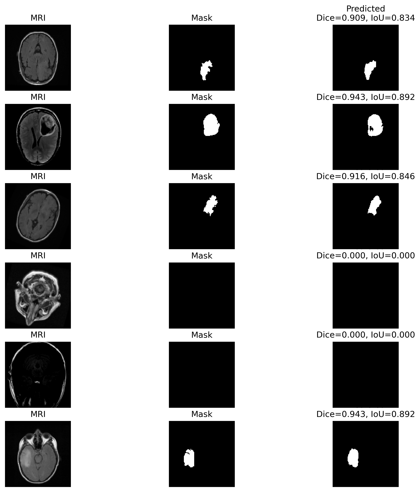
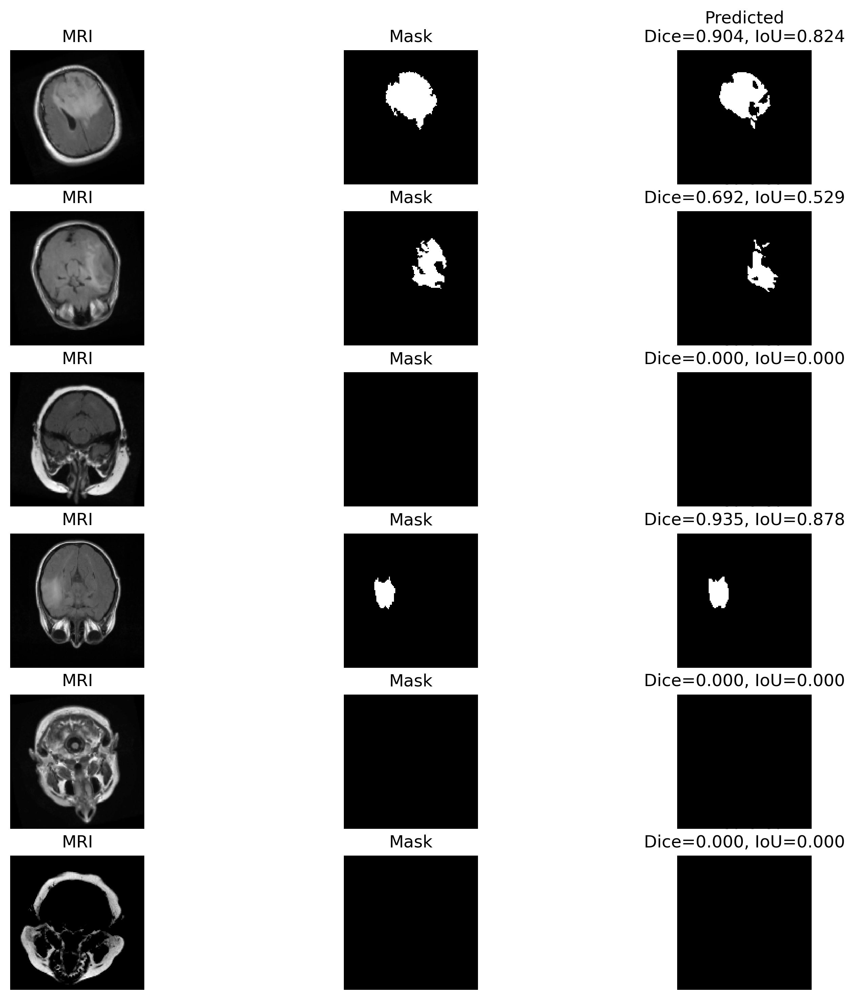

# 🧠 MRI Tumor Segmentation with U-Net

# 📌 Overview

This project demonstrates **tumor segmentation on MRI scans** using a **U-Net architecture** implemented in PyTorch inside a **single Jupyter Notebook**.
The task is to predict binary masks that highlight tumor regions from MRI images.
---
<p align="center">
  
</p>
<p align="center">
  
</p>
---

## ⚡ Highlights

* Implemented **U-Net** with **skip connections, batch normalization, and dropout**.
* Explored multiple **loss functions** to handle class imbalance:

  * **Binary Cross Entropy (BCE)**
  * **Dice Loss**
  * **BCE + Dice (best performing)**
  * **BCE + Dice + Tversky** (did not yield improvement)
* Evaluated segmentation using **Dice coefficient** and **Intersection over Union (IoU)**.
* Achieved:

  * **Dice Score:** \~86%
  * **IoU Score:** \~78%

---

## 📊 Results


| Metric | Score  |
| ------ | ------ |
| Dice   | \~0.86 |
| IoU    | \~0.78 |

---

## 🧮 Dice vs IoU

* **Dice coefficient:** measures overlap relative to both prediction & ground truth sizes (more forgiving).
* **IoU:** measures overlap relative to union (stricter, penalizes false positives).

---

## 🚀 How to Run

1. Open the notebook:

   ```bash
   jupyter notebook MRI_Tumor_Segmentation.ipynb
   ```
2. Run all cells (training, evaluation, visualization).
3. Inspect results & metrics directly in the notebook.

---

## 🛠️ Tech Stack

* **Python 3.9+**
* **PyTorch**
* **Matplotlib**
* **NumPy**

---

## 📜 Notes

* Best results achieved with **BCE + Dice loss**.
* Adding **Tversky** to the loss did not improve performance.
* The notebook includes metric calculation, training logs, and visualization utilities.

---
